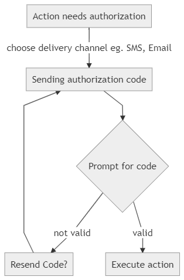

# Authorizator


This is an easy to use, powerful and extendable Laravel package for the authorization of user actions via custom channels. It works by delivering an authorization code to the user (for e.g. via sms or e-mail) and then verifing it. 

You can configure as many channels as you want. Each action can provide any channel configuration.
Blade template and VUE component included. 

**Using this package you can define separate actions such as: two factor authorization, deleting account, authorizing transaction etc. by custom code delivery channels (for eg. SMS, e-mail etc.).**


Examples of use:
* two factor authorization,
* authorize user data change,
* confirm transactions,
* confirm deleting account,
* confirm phone number,
* **any other actions that requires user authorization by separate channels like e-mail, sms, voice call, etc.**


## Table of contents
* [Installation](#installation)
* [How it works](#how-it-works)
    * [How it works in details](#how-it-works-in-details)
        * [Create authorization by POST method](#create-authorization-by-post-method)
* [How to use](#how-to-use)
    * [Preparations](#preparations)
    * [Create code delivery channel](#create-code-delivery-channel)
    * [Create an authorization](#create-an-authorization-action)
    * [Make it works](#make-it-works)
* [Customization](#customization)
    * [Migration](#migrations)
    * [Routing](#routing)
    * [Blade View](#blade-view)
    * [vue component](#vue-component)
    * [Localization](#localization)
* [Delete expired codes](#delete-expired-codes)
* [Contributing](#contributing)
* [Feedback](#feedback)
* [License](#license)

## Installation
Add package by composer 

`composer require tzm/authorizator`

To learn how to configure the package go to [How to use](#how-to-use) section

## How it works
Flow of package is presented on image below:



1. If action that needs additional authorization occurs, the form is displayed. **User must be logged in**.
2. User chooses the channel (each action can have own channels, by default you can use one or 
as many channels as you want.
3. Code is generated and send via given channel to a user.
4. A user enters the code.
5. After a successful validation of the code the custom action is executed.

### How it works in details
To understand package workflow let's get deeper into details. 

There are two types of classes that need to provide `Tzm\Authorizator\AuthorizatorAction` and `Tzm\Authorizator\Service\AuthorizatorChannels\Channel`. Both are abstract, which means that you have to inherit them in your implementation. First one is responsible for handling the given action of authorization. In this class you will set the action that will be executed after successful verification of the authorization code. This class also has the information about the return path after validation, code time expiration and allowed channels. The second one provides code delivery channel like e-mail, SMS, etc. It contains a method that delivers the authorization code to the user . 

Out of the box this package comes with vue component. This component has all forms and methods. There are two endpoints: `authorization/send` and `authorization/check` (both use `POST` method). These endpoints are in `Tzm\Authorizator\AuthorizationController`. There is also `authorization/create` endpoint but this we will discussed later. 

In the Controller in which authorization is requested (or any other place like middleware etc.) new authorization in database is created. This happens by executing static method `Transaction::createAuth()`.
 The `Transaction` object extends `Tzm\Authorizator\AuthorizatorAction` class. Also new variable is stored in user session (with default name `_authorizator_uuid` and contains `uuid` form database). Next by `returnView()` method the view is returned to user. So, simply the Controller will look like:
```php
use App\Services\AuthorizationActions\Transaction;

class TransactionController extends Controller
{
    public function create()
    {
        return Transaction::createAuth()->returnView();
    }
}
```

**Notice:** `Transaction` class inherit `Tzm\Authorizator\AuthorizatorAction`.

In the vue component user chooses delivery channel (if there is more than one). Request is sent to `authorization/send` endpoint by `POST` method.  

Next, code is delivered to the user, by a method `sendMessage()` from inherited class of `Tzm\Authorizator\Service\AuthorizatorChannel\Channel`. This is done by `authorization/send` endpoint.

User enters this code into form. If code is valid (`authorization/check` endpoint), it is set in database as used (column `verified_at` is set to current time). Finally the `afterAuthorization()` from inherited `Tzm\Authorizator\AuthorizatorAction` class is executed. This is the most important action in this package. In this method you write the code that will be run after successful validation of the code. 

#### Create authorization by POST method
If your application needs to create a new authorization code by `POST` method you can use `authorization/create` endpoint. 
In your `POST` request you have to add a `class` parameter with name of class extending `AuthorizatorAction`.

## How to use

### Preparations 
**NOTICE!** 

_Out of the box this package uses vue component as default but if you don't wont use vue.js as your frontend framework you can create your own form handler._

To use vue component that handles authorization, declare in `app.js` package's `.vue` file:

```js
Vue.component('authorizator-form', require('../../vendor/tzm/authorizator/src/resources/js/components/AuthorizatorForm').default);
```

Don't forget to run `npm run watch` to generate assets!

Notice that your application needs to use vue.js: https://laravel.com/docs/master/frontend#writing-vue-components.

Read more about customization package in [Customization](#customization) section.

### Create code delivery channel
You can add an example channel class by 
```bash
php artisan vendor:publish --tag=authorizator.example-channel
```
This class will be published in `app/Services/AuthorizatorChannels/` folder. 

Note that channel class must extend `Tzm\Authorizator\Service\AuthorizatorChannels\Channel` abstract class otherwise `AuthorizatorException` will be thrown. 

This class requires two methods:
 * `getChannelDescription()` - will generate description of current channel, f.ex. it could be generated from  localization `.json` file. It will be shown in channel choose form in the radio label.
 * `getChannelName()` - returns channel name. It will be displayed if there will be only one channel.  
 * `sendMessage(User $user, $code)` - this method provide code delivery to the user. In this method you will handle how the code will  be delivered to user. F.ex. if you want to send code by email you can use Laravel mail facade: 
 `Mail::to($user)->send(new SendAuthorizationCode($code))`. 
 
 Don't forget to run `composer dump-autoload`.

### Create an authorization action
Afterwards you have to create a new class that inherits `Tzm\Authorizator\AuthorizatorAction`. It handles an action that requires authorization. 

Class must declare method `afterAuthorization()`. This method will be called after successful authorization f.ex. a money transfer will be executed. By `$this->authorizarion` you can access to your `Authorization` model. Finally you have to define `$allowedChannels` array contains name of code delivery channel classes that will be assign to this action f.ex.:
```php
protected $allowedChannels = [
    EmailChannel::class,
    SmsChannel::class,
];
``` 
Furthermore you can set the code expiration time of in `$expiresInMinutes` property (it will be store in database) and in `$returnRoute` returning route (executed after successful authorization). If you want to generate custom code - override `generateCode()` method.

Notice that if your app implements `User` model is in other namespace than `App\User` you can override method 
`AuthorizatorAction::getUser()`.

Don't forget to run `composer dump-autoload`.

### Create view template
The package's view contains only form with vue component:
```html
<div class="container">
    <div class="row justify-content-center">
        <div class="col-md-8">
            <div class="card">
                <div class="card-header">Authorization</div>
                <div class="card-body">
                    <authorizator-form
                        allowed_channels="{{ json_encode($allowedChannels) }}"
                    >
                        You have to verify this action.
                    </authorizator-form>
                </div>
            </div>
        </div>
    </div>
</div>
```
So to implement it in your application you have to publish it:
```bash
php artisan vendor:publish --tag=authorizator.views
```
Finally you can extends this view for your master template. Don't worry, this view is initialized in `AuthorizatorProvider` with name so there is no more action needed. 

### Make it works
Finally we have all required elements: delivery channel class, action class, Blade view and generated vue component. Now it's time to set it all.

Create an example controller: 
```php
use App\Services\AuthorizationActions\Transaction;

class TransactionController extends Controller
{
    public function create()
    {
        return Transaction::createAuth()->returnView();
    }
}
```

Let's analyze the code.

`Transaction` extends `Tzm\Authorizator\AuthorizatorAction` class. 

In the public controller's method`create()` the `Transaction::createAuth()` method is executed. This will insert data to database and set `uuid` in session. Next method, returns default Blade view by `returnView()`. That's all! 

Now user can see the form and choose the authorization code deliver channel. After validation the method `afterAuthorization()` form `Transaction` class is executed.

Working example is available here: https://github.com/zmudzinski/authorizator-example
 
## Customization
All elements of this package are customizable. 

### Migrations
You can override migration by 
```bash
php artisan vendor:publish --tag=authorizator.migrations
```

### Routing
By default package routes are protected by `auth` and `web` middleware. They are defined in package `routes.php` file. You can override them by `php artisan vendor:publish --tag=authorizator.routes`. Then you have to  register new route file in `RouteServiceProvider` class. Add following method in `RouteServiceProvider`:
```php
protected function mapAuthorizatorRoutes(){
    Route::middleware('web')
        ->namespace($this->namespace)
        ->group(base_path('routes/authorizator.php'));
}
```
Then call it in `map()` method by `$this->mapAuthorizatorRoutes();`:

```php
    public function map()
    {
        //...
        $this->mapAuthorizatorRoutes();
    }
```

Next in `config/app.php` you have to change order in `providers` array. `\Tzm\Authorizator\AuthorizatorProvider::class` must be **before** `App\Providers\RouteServiceProvider::class`.

Finally you have to pass a prop to vue component with new endpoints:
```html
<authorizator-form
        :allowed-channels='{!! json_encode($allowedChannels) !!}'
        send-endpoint="/new/path/to/send/code"
        verify-endpoint="/new/path/to/verify/code"
>
    You have to verify this action.
</authorizator-form>
```

### Blade view
Default Blade view is in `resource\views` folder. You have to publish this view to extend it to your master view:
 ```bash
php artisan vendor:publish --tag=authorizator.views
```
 Blade view is using default Bootstrap framework. 

### vue component
Vue component is used in Blade view. It is responsible for handling whole authorization. You can use your own vue component. Use: 
```bash
php artisan vendor:publish --tag=authorizator.vue
```
Next you have to update declaration in `app.js` declaration of component.

**NOTICE!** There is no needs to use vue framework. If you want you can handle forms as you want.

### Localization
All of strings from PHP are translatable. All you have to do is to create a language file in `resource/lang` folder f.ex. `pl.json` with content:
```json
{
    "Code invalid": "Podany kod jest nieprawidłowy"
}
```
If you want to translate strings from `AuthorizationForm.vue` you can pass a translated props to component. 

## Delete expired codes
To remove all expired codes from database, simply use artisan command:
```bash
php artisan authorizator:purge 
```

## Contributing
1. Fork it
2. Create your feature branch: git checkout -b my-new-feature
3. Commit your changes: git commit -am 'My new feature'
4. Push to the branch: git push origin my-new-feature
5. Submit a pull request 

## Feedback
If you have any questions or problems fell free to contact us.

## License 
MIT